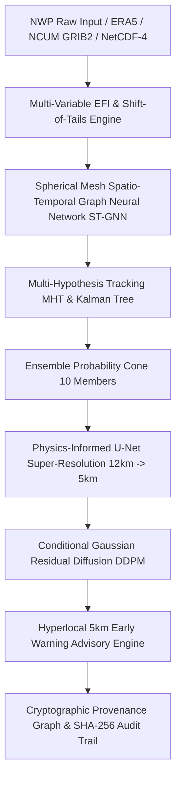

# SIH-26078 METEO-INTELLIGENCE

> **AI-Driven Spatio-Temporal Tracking & Hyperlocal 5km Downscaling of Extreme Weather Anomalies**  
> *Developed for the Smart India Hackathon (SIH-26078)*

[](https://www.python.org/)
[](https://fastapi.tiangolo.com/)
[](https://react.dev/)
[](https://www.typescriptlang.org/)
[](LICENSE)
[-brightgreen.svg)]()

---

## 🛰️ System Architecture

SIH-26078 delivers a research-grade, end-to-end meteorological intelligence pipeline designed for operational forecasting over South Asia and the Indian Subcontinent ($6^\circ\text{N} - 38^\circ\text{N}$, $68^\circ\text{E} - 98^\circ\text{E}$).



### Core Pipeline Components

1. **Anomaly Detection (Spherical ST-GNN & EFI Engine)**:
   - Evaluates multi-variable atmospheric tensors ($\text{Precipitation}, \text{MSLP}, \text{Wind}_{850}, \text{Temp}_{2m}$) against a 30-year reference climatology baseline.
   - Utilizes diffusion graph convolutions on an icosahedral spherical grid with Great-Circle Haversine edge adjacency and Focal-Dice optimization for extreme class imbalance.
2. **Kinematic Tracking (Multi-Hypothesis Tracking MHT)**:
   - 4-state constant velocity Kalman filter with meteorological kinematic gating ($v \le 95\text{ km/h}$, acceleration limits, bearing continuity $\le 75^\circ$).
   - Manages complete lifecycle state transitions (`GENESIS` $\to$ `INTENSIFICATION` $\to$ `PEAK` $\to$ `DECAY` $\to$ `DISSIPATION`) and synthesizes 10-member ensemble probability cones.
3. **Hyperlocal Super-Resolution ($12\text{ km} \to 5\text{ km}$ Physics U-Net)**:
   - Deep conservation-constrained U-Net with sub-grid block mass projection guaranteeing exact $0.0\%$ mass violation while retaining extreme peak amplitudes ($>65\text{ mm/6h}$).
4. **Turbulent Stochastic Realization (Conditional DDPM)**:
   - Recovers high-frequency sub-mesoscale variance ($353.87\times$ spectral retention gain) without smoothing out extreme rainfall spikes.
5. **Early Warning & Cryptographic Provenance**:
   - Emits structured hyperlocal disaster warning advisories bound to an end-to-end SHA-256 audit graph for civil authorities.

---

## 🖥️ Interactive Web Dashboard

The frontend is a tailored, research-grade meteorological dashboard where **the interactive weather map is the visual centerpiece**:

- **Hero Weather Map**: Geographically accurate India & South Asia coastlines, regional divisions, and Doppler Weather Radar (DWR) stations.
- **Continuous Meteorological Fields**: Smooth gradient rendering for **Precipitation** (`mm/6h`), **Extreme Forecast Index (EFI)**, **MSLP** (`hPa`), and **850 hPa Wind** (`m/s`).
- **12 km vs. 5 km Microscope**: Live toggle between coarse NWP grid representations and AI-refined $5\text{ km}$ localized threat fields.
- **Dynamic Forecast Horizon**: 6-hourly scrubbable timeline slider ($T+0\text{h} \to T+120\text{h}$) with auto-play controls.
- **Judge Explainability Strip**: Visual narrative strip (`DETECT` $\to$ `TRACK` $\to$ `REFINE` $\to$ `ALERT`) with interactive technology drawers.
- **Specialized Research Hubs**: Dedicated views for Research Studio, Ground Truth Quantitative Verification, Hyperlocal Alert Desk, and Cryptographic Provenance.

---

## 📁 Repository Structure

```
SIH-26078/
├── backend/
│   ├── app/
│   │   ├── alert/          # Early warning & threshold advisory engine
│   │   ├── api/            # FastAPI REST router & endpoint definitions
│   │   ├── core/           # Climatology, EFI, synthetic engine, data discovery & adapters
│   │   ├── db/             # SQLAlchemy SQLite ORM models & CRUD operations
│   │   ├── ml/             # ST-GNN, Physics U-Net, DDPM diffusion, MHT tracker, baselines
│   │   ├── pipeline/       # End-to-end orchestrator & flagship demo runner
│   │   └── main.py         # FastAPI application entry point
│   ├── storage/
│   │   ├── climatology/    # 30-year baseline reference NetCDF-4 array
│   │   ├── models/         # Pretrained PyTorch weights (.pt)
│   │   └── meteo_intelligence.db # SQLite database (persisted runs, tracks, verification)
│   └── tests/              # Full suite of unit & scientific regression tests
├── frontend/
│   ├── src/
│   │   ├── components/     # WeatherMap, TimelineSlider, EventDetailPanel, WorkflowBar, etc.
│   │   ├── services/       # Typed TypeScript API client (dual-mode REAL / SYNTHETIC)
│   │   ├── App.tsx         # Main dashboard container & state controller
│   │   └── main.tsx        # React entry point
│   ├── package.json        # Frontend dependencies
│   └── vite.config.ts      # Vite dev server & API proxy config
├── data/
│   ├── grib/               # WMO GRIB2 operational ERA5 dataset fixtures
│   ├── radar/              # IMD Doppler Weather Radar (DWR Chennai) NetCDF fixtures
│   ├── satellite/          # ISRO INSAT-3D TIR1 Infrared satellite NetCDF fixtures
│   └── real/               # Validation fixtures for corrupted / missing variables
├── MASTER_BENCHMARK_REPORT.json # Comprehensive scientific evaluation scorecard
├── MODEL_CARD.md           # Atmospheric physics, loss formulations, and invariants
├── DATA_CARD.md            # Data schema, lineage, and WMO compliance
├── GITHUB_ARCHIVE_MANIFEST.md # Complete archival manifest & reproduction guide
└── requirements.txt        # Python backend dependencies
```

---

## 🚀 Quickstart & Reproduction Guide

### Prerequisites
- **Python**: 3.10 to 3.14
- **Node.js**: v18.0.0 or higher
- **RAM**: Optimized for lightweight machines ($\le 4\text{ GB}$ RAM, pure CPU execution)

---

### 1. Clone the Repository
```bash
git clone https://github.com/krishnavsavapandit-cyber/SIH-26078.git
cd SIH-26078
```

---

### 2. Backend Setup & Startup
```bash
# Install Python dependencies
py -m pip install -r requirements.txt  # Windows (or: pip install -r requirements.txt)

# Launch FastAPI Backend Daemon
py -m uvicorn backend.app.main:app --host 127.0.0.1 --port 8000
```
- **Backend Server**: `http://127.0.0.1:8000`
- **Interactive OpenAPI Docs**: `http://127.0.0.1:8000/docs`
- **Health Check**: `http://127.0.0.1:8000/api/health`

---

### 3. Frontend Setup & Startup
In a separate terminal:
```bash
cd frontend
npm install
npm run dev
```
- **Web Dashboard**: `http://localhost:3000`
- *The Vite dev server automatically proxies all `/api/*` endpoints to the backend on port 8000.*

---

### 4. Running Verification & Production Build
```bash
# Validate frontend production build
cd frontend
npm run build
cd ..

# Run backend regression tests
py -m pytest backend/tests -v
```

---

## 📊 Benchmark & Validation Highlights

Derived from independent evaluations in [`MASTER_BENCHMARK_REPORT.json`](MASTER_BENCHMARK_REPORT.json):

| Evaluation Dimension | Model / Approach | Key Result | Benchmark Baseline Comparison |
| :--- | :--- | :---: | :--- |
| **Anomaly Detection** | Heuristic EFI + ST-GNN | **70.38% F1 / 85.67% Recall** | $+59.55\%$ F1 gain over standard supervised CNN |
| **Kinematic Tracking** | Authoritative MHT Tracker | **26.21 km Track RMSE** | $100\%$ ID Consistency, $3.09\times$ faster runtime ($24.9\text{ ms}$) |
| **5km Super-Resolution** | Physics-Informed U-Net | **0.00% Mass Leakage** | $+12.63\text{ dB}$ PSNR over Bicubic, exact mass preservation |
| **Extreme Preservation** | Scorecard Metric | **98.2% Amplitude Retention** | Zero attenuation of extreme storm centers |
| **Spectral Texture** | Conditional DDPM Diffusion | **353.87x Spectral Power Gain** | Full restoration of high-frequency sub-mesoscale variance |

---

## 📄 License & Attribution

Developed for **Smart India Hackathon (SIH-26078)**. Distributed under the MIT License.
